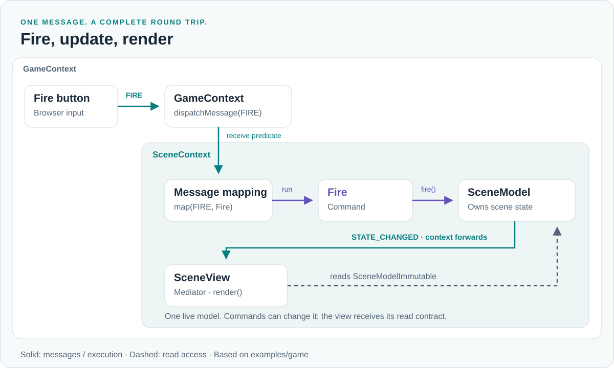

<picture>
  <source media="(prefers-color-scheme: dark)" srcset="docs/assets/domwires-dark.svg">
  
</picture>

# DomWires 5.0

**Typed messages. Explicit state changes. Components with clear lifetimes.**

DomWires is a dependency-free TypeScript framework for composing applications from models, mediators, commands and contexts. It works in browsers and Node.js, alongside your UI or rendering library.

A context connects components through messages and contracts. Commands change model state. Mediators translate input and render the live state exposed by Immutable interfaces. Context boundaries make dependencies, routing and cleanup explicit.

[Get started](docs/getting-started.md) · [Documentation](docs/index.md) · [API reference](docs/api.md) · [Examples](docs/examples.md)

> **5.0 introduces a new API.** The previous implementation is preserved on [`v2.x`](https://github.com/CrazyFlasher/domwires-ts/tree/v2.x). See the [changelog](CHANGELOG.md) and [release guide](docs/release.md).

## How it fits together

<picture>
  <source media="(prefers-color-scheme: dark)" srcset="docs/assets/message-flow-dark.svg">
  
</picture>

This is one real route from the scene lab. [The walkthrough](docs/examples.md) expands it to nested contexts, level loading, cancellation and HUD updates.

| Component | Responsibility |
| --- | --- |
| Model | Owns state and emits change notifications. |
| Immutable interface | Exposes the same live model without its mutation methods. It does not freeze or clone the object. |
| Mediator | Translates external input into messages and renders readable state. |
| Command | Performs an application action, synchronously or asynchronously. |
| Context | Composes components, maps messages, controls boundaries and owns lifetimes. |
| Adapter | Ordinary infrastructure object used by commands; no required Service base class. |

## Quick start

Install DomWires in your application:

```sh
npm install domwires@^5.0.0
```

To build this repository and run the examples:

```sh
npm ci
npm run build
npm run example
```

Open the printed localhost URL for the counter and scene lab. To test local changes in another application, run `npm pack` and install the resulting tarball. Import from `domwires`.

A complete message-to-command program:

<!-- snippet: docs/snippets/quick-start.ts -->
```ts
import {AbstractCommand, AbstractContext, Factory, MessageType} from "domwires";

const GREET = new MessageType<{name: string}>("greet");

class Greet extends AbstractCommand<{name: string}>
{
    public override execute(input: {name: string}): void
    {
        console.log("Hello, " + input.name + "!");
    }
}

class AppContext extends AbstractContext
{
    protected override init(): void
    {
        super.init();
        this.map(GREET, Greet);
    }
}

async function main(): Promise<void>
{
    const factory = new Factory();
    const app = factory.getInstance(AppContext);

    try
    {
        app.dispatchMessage(GREET, {name: "DomWires"});
        await app.settle();
    }
    finally
    {
        await app.close();
        factory.dispose();
    }
}

void main();
```

Create contexts through the factory so their initialization hook runs. `dispatchMessage()` delivers synchronously; `settle()` drains command work; `close()` cancels and awaits teardown. Continue with the [counter model and mediator](docs/getting-started.md#add-state-and-presentation).

## What 5.0 brings

- **Typed contracts:** payloads, command input, model access and dependency tokens checked together.
- **Scoped composition:** separate roles for commands, models, mediators and adapters; explicit child-context imports.
- **Native async commands:** invocation-local state, cooperative cancellation and guarded model commits.
- **Per-mapping concurrency:** parallel, serial, latest and drop policies; disposable registrations and guards.
- **Owned resources:** startup, reverse-order cleanup and an awaitable close boundary.
- **Observable execution:** optional trace callbacks with correlated IDs, isolated observer failures and no built-in history buffer.
- **Flexible construction:** constructor/provider injection or optional legacy property decorators; no reflection-metadata dependency.

## Explore the examples

| Example | Focus |
| --- | --- |
| [Counter](examples/frontend/CounterContext.ts) | Basic model/mediator flow, read/write tokens, guards and remounting |
| [Scene lab](examples/game/contexts/GameContext.ts) | Nested contexts, tick, projectile reuse, async loading, scene switching and trace |
| [Concurrent requests](examples/scoped/RequestContext.ts) | Scoped injection and cancellation before committing a result |
| [Node config](examples/node/config-app.ts) | Platform-specific JSON loading through `domwires/node` |

## Runtime and development

Built with TypeScript 7, targeting ES2022. The package declares Node 20+ and the CI workflow checks Node 20/22/24. The root entry point is browser-compatible; Node-specific loading is a separate export. Node ESM and CommonJS entry points share the same classes, tokens and registries, so mixing `import` and `require` preserves identity. Browser bundlers select one native ESM implementation for both import styles. Both formats include declarations and source maps; application types are checked with TypeScript 6 and 7.

Property decorators use `experimentalDecorators`; constructor and provider injection need no decorator syntax. Runtime dependencies are empty.

See [contributing](docs/contributing.md) for the complete verification commands, source organization and generated API documentation. Public method contracts live in source comments and are carried into declaration files.

## License and origins

MIT. DomWires grew from ActionScript 3 and Haxe implementations; 5.0 keeps the component model while making TypeScript contracts and lifetimes explicit. [Visual identity and logo references](docs/brand.md).
