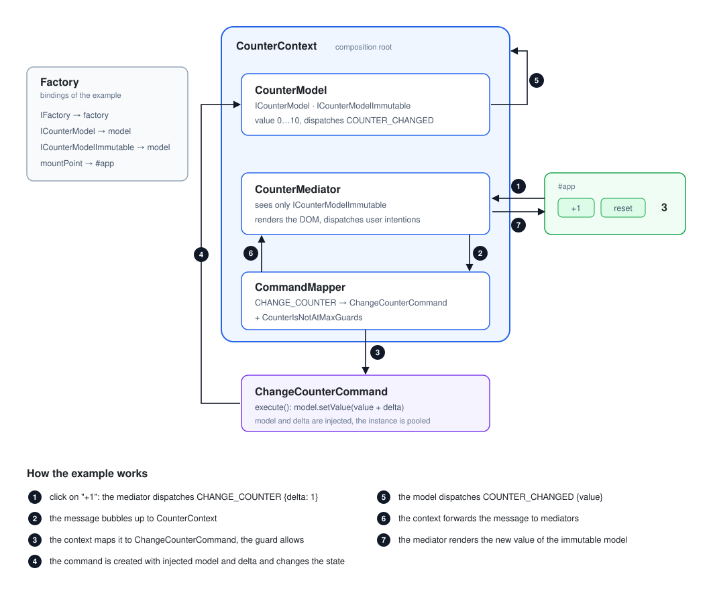

## DomWires [](https://github.com/CrazyFlasher/domwires-ts/actions/workflows/test.yml)

Flexible and extensible MVC framework for TypeScript: a message bus, contexts as composition roots,
commands with guards and a small dependency binder. It has no runtime dependencies and works both
in a browser and in node.

```bash
npm install domwires
```

* Node.js 20 or newer, TypeScript 7 or newer.
* `experimentalDecorators` is required only if you use the decorators (`@inject`, `@lazyInject`).
* Runnable example: [`examples/frontend`](./examples/frontend) — a counter app, `npm run example`.

### Why

Business logic lives in models, the visual part lives in mediators, and they never reference each
other: everything goes through messages and commands.

* Mediators see **read only** interfaces of models and dispatch messages instead of calling methods.
* A context maps messages to commands, so the same message can trigger one command, a batch of
  commands or nothing at all, depending on the current state of the application.
* Commands are the only place where the state is changed, which makes them easy to test and to guard.
* Objects are created through a factory with injections, so any part can be replaced on a platform
  or in a test.

***

### Quick start

The counter example, one class per file — the same layout as in the framework itself. The full
version is in [`examples/frontend`](./examples/frontend): a click on "+1" makes the mediator dispatch
a message, the context maps it to a command, the command changes the model, the model tells about it
and the mediator renders the new state.



```ts
// AppMessage.ts
import {MessageType} from "domwires";

export type ChangeCounterData = {
    readonly delta: number;
};

export class AppMessage extends MessageType
{
    public static readonly COUNTER_CHANGED: MessageType<{value: number}> = new AppMessage("COUNTER_CHANGED");
    public static readonly CHANGE_COUNTER: MessageType<ChangeCounterData> = new AppMessage("CHANGE_COUNTER");
}
```

```ts
// CounterModel.ts — a mediator gets only the immutable interface
import {AbstractHierarchyObject} from "domwires";
import {AppMessage} from "./AppMessage";

export interface ICounterModelImmutable
{
    get value(): number;
}

export interface ICounterModel extends ICounterModelImmutable
{
    setValue(value: number): ICounterModel;
}

export class CounterModel extends AbstractHierarchyObject implements ICounterModel
{
    private _value = 0;

    public get value(): number
    {
        return this._value;
    }

    public setValue(value: number): ICounterModel
    {
        this._value = value;
        this.dispatchMessage(AppMessage.COUNTER_CHANGED, {value: this._value});

        return this;
    }
}
```

```ts
// ChangeCounterCommand.ts — the only place, where the state is changed
import {AbstractCommand, AbstractGuards, lazyInject, lazyInjectNamed} from "domwires";
import {ICounterModel} from "./CounterModel";

export class ChangeCounterCommand extends AbstractCommand
{
    @lazyInject("ICounterModel")
    private model!: ICounterModel;

    @lazyInjectNamed("number", "delta")
    private delta!: number;

    public override execute(): void
    {
        this.model.setValue(this.model.value + this.delta);
    }
}

// CounterIsNotAtMaxGuards.ts — the guard of the mapping
export class CounterIsNotAtMaxGuards extends AbstractGuards
{
    @lazyInject("ICounterModel")
    private model!: ICounterModel;

    public override get allows(): boolean
    {
        return this.model.value < 10;
    }
}
```

```ts
// CounterMediator.ts — renders the model and dispatches user intentions
import {AbstractHierarchyObject, IMessage, inject, postConstruct} from "domwires";
import {AppMessage, CounterChangedData} from "./AppMessage";
import {ICounterModelImmutable} from "./CounterModel";

export class CounterMediator extends AbstractHierarchyObject
{
    @inject("mountPoint")
    private mountPoint!: HTMLElement;

    @inject("ICounterModelImmutable")
    private model!: ICounterModelImmutable;

    private valueLabel!: HTMLElement;

    @postConstruct()
    private init(): void
    {
        this.valueLabel = document.createElement("strong");

        const button: HTMLButtonElement = document.createElement("button");
        button.textContent = "+1";
        button.addEventListener("click", () => this.dispatchMessage(AppMessage.CHANGE_COUNTER, {delta: 1}));

        this.mountPoint.append(button, this.valueLabel);

        this.addMessageListener(AppMessage.COUNTER_CHANGED, (message: IMessage, data?: CounterChangedData) =>
        {
            this.valueLabel.textContent = " " + this.model.value;
        });

        this.valueLabel.textContent = " " + this.model.value;
    }
}
```

```ts
// CounterContext.ts — the composition root
import {AbstractContext} from "domwires";
import {AppMessage} from "./AppMessage";
import {ChangeCounterCommand} from "./ChangeCounterCommand";
import {CounterIsNotAtMaxGuards} from "./CounterIsNotAtMaxGuards";
import {CounterMediator} from "./CounterMediator";
import {CounterModel, ICounterModel} from "./CounterModel";

export class CounterContext extends AbstractContext
{
    protected override init(): void
    {
        super.init();

        const model: CounterModel = this.factory.getInstance<CounterModel>(CounterModel);

        this.addModel(model);

        // commands get the mutable model, mediators get the read only interface
        this.factory.mapToValue<ICounterModel>("ICounterModel", model);
        this.factory.mapToValue("ICounterModelImmutable", model);

        this.addMediator(this.factory.getInstance<CounterMediator>(CounterMediator));

        this.map(AppMessage.CHANGE_COUNTER, ChangeCounterCommand).addGuards(CounterIsNotAtMaxGuards);
    }
}
```

```ts
// main.ts — bootstrap
import {Factory, IFactory, Logger, LogLevel} from "domwires";
import {CounterContext} from "./CounterContext";

const factory: IFactory = new Factory(new Logger(LogLevel.INFO));

factory.mapToValue("IFactory", factory);
factory.mapToValue("mountPoint", document.querySelector<HTMLElement>("#app") ?? document.body);

factory.getInstance<CounterContext>(CounterContext);
```

***

### Messages

A message type is a strict type marker for the data, that can be dispatched with it. Every dispatch
creates its own message instance, so a nested dispatch can not corrupt the message of an outer one.

```ts
this.dispatchMessage(AppMessage.CHANGE_COUNTER, {delta: 1});       // bubbles to the parents (default)
this.dispatchMessage(AppMessage.RESET_COUNTER, undefined, false);  // stays in this object
```

```ts
object.addMessageListener(AppMessage.COUNTER_CHANGED, this.onCounterChanged);
object.addMessageListener(AppMessage.COUNTER_CHANGED, this.onceListener, true);   // once = removed after the first call
object.addMessageListener(AppMessage.COUNTER_CHANGED, this.first, false, 10);     // priority = called earlier
object.removeMessageListener(AppMessage.COUNTER_CHANGED, this.onCounterChanged);
object.removeAllMessageListeners();
```

Inside a listener you can read the message (`type`, `data`, `initialTarget`, `currentTarget`,
`previousTarget`, `bubbles`) and stop the further propagation with `message.stopPropagation()`.
Listeners may be added and removed during a dispatch: removals are applied after the current
listener list is processed, so no listener is skipped.

### Hierarchy

`AbstractHierarchyObject` is an object with a parent; `HierarchyObjectContainer` is an object of the
same kind, that holds children. Messages bubble up along the parent chain, and a container can stop
that by returning `false` from `onMessageBubbled()`.

```ts
const container: HierarchyObjectContainer = new HierarchyObjectContainer();

container.add(model);                 // by order
container.add(model, "appModel");     // by id, get("appModel") returns it
container.remove("appModel", true);   // the second argument disposes the child
container.removeAll(true);

model.parent;              // container
model.root;                // the first context above the object
container.dispatchMessageToChildren(message, data, (child) => child !== origin);
```

### Contexts

A context is a container plus a command mapper. It owns models and mediators, forwards messages
between them and executes commands. Child contexts bubble their messages up when they return `true`
from `onMessageBubbled()`.

```ts
export class AppContext extends AbstractContext
{
    protected override init(): void
    {
        super.init();

        this.addModel(model);
        this.addMediator(mediator);
        this.addModel(childContext, "child");
    }
}
```

| Messages | Forwarded by default |
| --- | --- |
| from models to mediators | yes |
| from mediators to mediators | yes |
| from models to models | no |
| from mediators to models | no |

The object, that dispatched a message, never gets it back, and `dispatchMessageToChildren()` skips
the previous target of the message. The rules above can be changed by mapping another config:

```ts
const config: ContextConfig = new ContextConfigBuilder().build();

factory.mapToValue("ContextConfig", config);
```

### Commands

A context maps a message to commands. Everything, that is mapped in the factory of the context, is
injected into a command, and so is the data of the message: properties of the data are bound by
their type and name, so `{delta: 5}` is available as `@lazyInjectNamed("number", "delta")`.

```ts
this.map(AppMessage.CHANGE_COUNTER, ChangeCounterCommand)           // MappingConfig
    .addGuards(CounterIsNotAtMaxGuards)                             // executes only if allows === true
    .addGuardsNot(IsLoadingGuards)                                  // executes only if allows === false
    .addTargetGuards(model);                                        // executes for the given initial target only

this.map([AppMessage.CHANGE_COUNTER, AppMessage.RESET_COUNTER], [ChangeCounterCommand, LogCommand]);
this.map(AppMessage.CHANGE_COUNTER, ChangeCounterCommand, {delta: 10}, true, true);  // stopOnExecute, once

this.executeCommand(ChangeCounterCommand, {delta: 1});              // out of a message handling
```

**Commands are executed asynchronously, while `dispatchMessage()` stays synchronous.** A context
collects the started commands, so a test or an application can wait for them:

```ts
mediator.dispatchMessage(AppMessage.CHANGE_COUNTER, {delta: 1});

await context.settle();   // waits for all commands, rejects if one of them failed
```

An error of a command is never lost: it is reported through the logger and rejects `settle()`.

### Async commands

A command, that does not finish right away (a request, a file, an animation), extends
`AbstractAsyncCommand`: `execute()` starts the work and `resolve()` tells the framework, that the
command is done.

```ts
// LoadUserCommand.ts
import {AbstractAsyncCommand, lazyInject, lazyInjectNamed} from "domwires";
import {IUserModel} from "./UserModel";

export class LoadUserCommand extends AbstractAsyncCommand
{
    @lazyInjectNamed("string", "id")
    private id!: string;

    @lazyInject("IUserModel")
    private model!: IUserModel;

    public override execute(): void
    {
        fetch("/api/users/" + this.id)
            .then((response: Response) => response.json())
            .then((user: IUser) => this.complete(user))
            .catch((e: unknown) =>
            {
                console.error("Cannot load the user:", e);

                // resolve() is called on the error path as well, see the note below
                this.resolve();
            });
    }

    private complete(user: IUser): void
    {
        this.model.setUser(user);
        this.resolve();
    }
}
```

```ts
context.map(AppMessage.LOAD_USER, LoadUserCommand);

mediator.dispatchMessage(AppMessage.LOAD_USER, {id: "7"});   // returns immediately
await context.settle();                                      // the command is done here
```

Notes:

* `dispatchMessage()` stays synchronous: it starts the command and returns, the caller decides
  whether to wait with `settle()`, `tryToExecuteCommand()` or `executeCommand()`;
* the mapper awaits an async command, so the order of the mapped commands is kept, including a mix
  of synchronous and asynchronous ones, and `stopOnExecute` works as expected;
* `AbstractAsyncCommand` has no "reject" hook: on a failure call `resolve()` anyway and report the
  error yourself, otherwise the command never finishes and `settle()` waits forever;
* an exception, thrown by `execute()` before the first `await`, rejects the command promise and is
  reported like an error of a synchronous command.

### Guards

A guard is a small object, that answers one question: may a command be executed right now.
Guards are pooled together with commands, so they are created once per context.

```ts
export class CounterIsNotAtMaxGuards extends AbstractGuards
{
    @lazyInject("ICounterModel")
    private model!: ICounterModel;

    public override get allows(): boolean
    {
        return this.model.value < this.model.maxValue;
    }
}
```

### Dependency injection

The framework brings its own binder: no `reflect-metadata` and no metadata emission are needed,
all service identifiers are explicit. The container creates an instance, injects properties and
calls the post construct hook.

```ts
const factory: IFactory = new Factory(new Logger(LogLevel.INFO));

factory.mapToType("INetworkConnector", TcpNetworkConnector);   // a new instance on each resolution
factory.mapToValue("IConfig", config);                         // the same value every time
factory.mapToValue("string", "en", "locale");                  // a named binding

factory.unmapFromType("INetworkConnector");
factory.getInstance<INetworkConnector>("INetworkConnector");
```

```ts
export class UIMediator extends AbstractHierarchyObject
{
    @inject("IConfig")
    private config!: IConfig;

    @inject("string") @named("locale")
    private locale!: string;

    @inject("ILogger") @optional()
    private logger: ILogger | undefined;      // undefined, when there is no binding

    @lazyInject("ICommandMapper")
    private commandMapper!: ICommandMapper;   // resolved on every access, not once at creation

    @postConstruct()
    private init(): void
    {
        // called right after all properties are injected
    }
}
```

Notes:

* injection happens after the constructor, so a property initializer does not overwrite an injected value;
* an unmapped class is instantiated as is, an unmapped string identifier throws;
* `@lazyInject` reads the global lazy registry, that the factory fills before every command execution:
  that is why a command, reused from a pool, always sees the values of the current execution;
* a class needs no `@injectable()` marker, it is kept for readability only;
* `DependencyContainer` can be used standalone, without the factory.

### Object pools

```ts
factory.registerPool(Bullet, 20, true, "isBusy");   // capacity, instantiate now, busy flag getter name

for (let i = 0; i < 100; i++)
{
    factory.getInstance(Bullet);                    // takes a free object of the pool
}

factory.getPoolCapacity(Bullet);
factory.getPoolInstanceCount(Bullet);
factory.getAllPoolItemsAreBusy(Bullet);
factory.increasePoolCapacity(Bullet, 5);
factory.unregisterPool(Bullet);
```

The pool hands out objects in a circle. If all of them are busy and the safe pool mode is on (it is
on by default), the capacity is increased by one and a log message is written; with the safe pool
mode off, `getInstance()` throws instead of returning a busy object.

### Application config

`AbstractApp` loads a JSON config of the application. The core has no dependencies on node
built-ins: the loader is injected, so a browser build stays clean while a node build reads a file.

```ts
import {AbstractApp, Factory, IFactory} from "domwires";
import {createNodeConfigLoader} from "domwires/node";

class App extends AbstractApp<{name: string}>
{
}

const factory: IFactory = new Factory();

factory.mapToValue("AppConfigLoader", createNodeConfigLoader());

const app: App = factory.getInstance<App>(App);
const config: {name: string} = await app.loadConfig("./dev.json");
```

Without an `AppConfigLoader` binding the config is loaded with `fetch`.

### Immutability

Mediators must not be able to change the state, so a model implements two interfaces: a mutable one
for commands and an immutable one for everyone else. It costs a couple of lines and removes a whole
class of bugs.

```ts
this.factory.mapToValue<IAppModel>("IAppModel", appModel);   // commands
this.factory.mapToValue("IAppModelImmutable", appModel);     // mediators
```

### Recipes

**Several implementations of one interface.** Map a different implementation per platform, per
context or per test, and even remap a command at runtime:

```ts
factory.mapToType("INetworkConnector", UdpNetworkConnector);
factory.mapToType(BaseUpdateCommand, ProjectUpdateCommand);
```

**Unsubscribe in `dispose()`,** so a removed mediator does not keep a reference to a model:

```ts
public override dispose(): void
{
    this.model.removeMessageListener(AppMessage.COUNTER_CHANGED, this.onCounterChanged);

    super.dispose();
}
```

**Testing.** Create the same context through a factory, dispatch a message and wait for commands:

```ts
const context: CounterContext = factory.getInstance<CounterContext>(CounterContext);

model.dispatchMessage(AppMessage.CHANGE_COUNTER, {delta: 5});

await context.settle();
expect(model.value).equals(5);
```

**Debugging.** Pass a logger to the factory: it prints mapping and pool messages, and a trace of the
caller can be turned on with `new Logger(LogLevel.VERBOSE).setTraceCaller(true)`.

The framework has its own logger as well: it stays silent by default and speaks up with
`setGlobalLogLevel(LogLevel.VERBOSE)`, which is useful when classes are mapped by name (for example,
from a config with `definableFromString`).

***

### Development

```bash
npm run typecheck      # the core, the tests and the examples
npm test               # compiles the tests with tsc and runs mocha
npm run lint           # oxlint
npm run build          # dist/
npm run test-browser   # bundles the tests and serves them in a browser
npm run example        # bundles examples/frontend and serves it
```

Tests and examples are compiled with the same strict settings as the library, so a documented
snippet can not silently rot.

How the binder, the message bubbling, the pools and the command mapping work inside is described in
[docs/architecture.md](./docs/architecture.md).

### License

MIT
