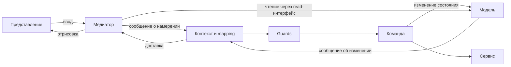

> Исторический аудит исходной ревизии 08c80f9. После него выполнена реализация в codex/domwires-v2-scopes: см. [изменения и проверки](../../docs/v2-implementation.md). Standalone probes ниже предназначены для исходной ревизии; актуальные regression tests находятся в test/V2ContractsTest.ts.

**Анализ DomWires 2.1.0 — 19 сентября 2026 года.** Основной вывод: стоит сохранить контексты, команды, guards и разделение доступа к моделям. Главная задача следующей итерации — обеспечить изоляцию выполнения команд и согласованный жизненный цикл объектов. Сейчас эти гарантии нарушаются в нескольких обычных сценариях, которые встречаются в ваших проектах. Обновление TypeScript и устранение внешних runtime-зависимостей полезны, но сами по себе этих вопросов не решают.

Это анализ и предложение изменений. Исходники библиотеки, её штатные тесты и API не изменены. Добавлены только материалы в `analysis/review-2026-09-19`; они не входят в текущий npm-пакет.

Уточнение после обсуждения: совместимость с legacy-проектами не является ограничением для v2. Старые проекты показывают полезные сценарии, но не обязывают сохранять прежние API, время жизни команд или схемы наследования. Суффикс `Immutable` можно сохранить как установленное в DomWires обозначение интерфейса без права изменения модели; обязательное переименование не предлагается.

**Область проверки.** Прочитано ядро текущей TS-версии: DI, фабрика, пулы, сообщения, иерархия, контексты, команды, disposal, загрузка конфигурации и логирование; изучены тесты, примеры, сборка и изменения относительно `legacy`. Исторические реализации и приложения проверены выборочно по архитектурным точкам: сборка контекстов, доступ к моделям, маршрутизация, последовательности команд, асинхронные запросы, пулы и завершение работы. Игры и старые Haxe/AS3-сборки не запускались; это не полный аудит всей игровой логики.

Перед анализом ветки сверены с GitHub через `git ls-remote --heads origin`. Переключать рабочие ветки не потребовалось: исходники других веток читались через Git.

| Репозиторий | Использованная версия | Зачем изучался |
| --- | --- | --- |
| domwires-ts | `main`, `08c80f9`, 18.09.2026; сравнение с `legacy`, `802af44` | Основной объект: 2.1.0 и предшествующая TS 0.9.130 |
| domwires-as3 | `master`, `f4c687e`, 09.07.2019 | Исходная архитектура, роли model/view, синхронные команды |
| domwires-haxe | свежая `origin/conf1`, `7c2aaaa`, 07.07.2022; ядро совпадает с `master`, `507c25d` | Перенос ролей в model/mediator и DI Haxe; различия conf1 с master только в README и одном тесте |
| kill-the-king | `origin/liongames`, `babc3ee`, 07.10.2025 | Частые игровые сообщения, составные команды, пулы и команды с состоянием |
| escape-engine-air | `origin/new_life`, `40c1254`, 05.01.2022 | Контексты модулей, сценарии, фабрики представления и моделей |
| escape-engine-hx | `master`, `f527a99`, 21.06.2024 | Те же прикладные паттерны после переноса на Haxe |
| domwires-devkit-ts | `main`, `15c25bb`, 19.10.2023 | Надстройка над legacy: пять фабрик, сервисы, клиент/сервер, async-обработчики |
| domwires-devkit-hx | `main`, `656eef1`, 22.09.2021 | Разграничение зависимостей по ролям, сервисы и каталог команд |

**Как я понимаю концепцию.** DomWires организует приложение в дерево локальных контекстов. Контекст собирает модели и медиаторы, определяет доступные зависимости и связывает сообщения с действиями. Медиатор читает состояние и переводит пользовательский ввод в намерения; команда выполняет сценарий, обращаясь к изменяемым моделям и сервисам; модель поддерживает своё состояние и сообщает об изменениях. Guards решают, допустим ли сценарий в текущих условиях. Фабрика подменяет реализации, создаёт объекты и управляет повторным использованием.



Это подход с локальными границами модулей и явными сценариями приложения. Его полезно описывать именно через эти свойства: аббревиатура MVC не объясняет ни guards, ни вложенные контексты, ни разграничение зависимостей. Модель должна сохранять свои инварианты внутри собственных методов; команда выбирает и координирует действия. Иначе при буквальном толковании «вся логика в командах» модели легко превратить в набор публичных setters, а бизнес-правила разнести по многим обработчикам.

**Что подтверждают проекты.** В AS3 действительно выделены [Model и View][as3-context]; в Haxe — [Model и Mediator][hx-context]. TS унифицирует их базовый тип и назначает роль через `addModel`/`addMediator`. Это разумное уменьшение дублирования, если роль поддерживается как строгая часть регистрации объекта.

В Kill the King [UpdateWorldCommand][ktk-update] хранит `lastUpdateTime`, а [карта GameContext][ktk-mapping] связывает игровой tick с этой командой. Следовательно, повторное использование команд для вас иногда является поведением приложения, а не только оптимизацией. [PoolManagerModel][ktk-pools] отдельно переиспользует физические модели, UI и объекты сообщений. Удалять пулы целиком не предлагаю; нужно разделить пул игровых объектов, singleton-сервис и экземпляр конкретного выполнения команды.

В Escape [AS3-команда сценария][air-scenario] и её [Haxe-аналог][hx-scenario] вызывают другие команды. Вложенные вызовы — реальный сценарий. В [ModuleContext Haxe][hx-module] видно множество ручных переносов зависимостей между фабриками, а [GameContext][hx-game] содержит большую карту действий с guards. Это аргументы в пользу дочерних DI-областей и композиции небольших модулей.

В [TS AppContext][ts-devkit-context] создаются фабрики контекстов, моделей, сервисов, медиаторов и views. Изменяемая модель попадает в командную фабрику, read-интерфейс — в фабрики других ролей. [Haxe AppContext][hx-devkit-context] решает ту же задачу. Это важная архитектурная идея: разный набор доступных зависимостей для разных участников. Её стоит сделать компактнее и надёжнее, сохранив ограничения доступа.

Наконец, [AbstractClientRequestHandler][ts-request] и [LoginCommand][ts-login] держат данные конкретного клиента и продолжают работу после `await`. Для таких обработчиков изоляция запросов обязательна. Привожу их как пример требований к ядру; сами сервисы devkit в этом анализе не тестировались как серверное приложение.

**Что уже стало лучше относительно legacy.** Убраны Inversify, reflect-metadata и другие runtime-зависимости; явные идентификаторы уменьшают зависимость от особенностей компилятора. Инъекции после конструктора не затираются инициализаторами полей. Добавлены строгие настройки компиляции, отдельный Node loader, новый экземпляр Message на dispatch, исправления удаления listeners и обработки вложенных контейнеров, ограниченный поиск свободного элемента пула. Ошибки команд теперь доступны через `settle()`, а 2.1.0 добавляет `reject()` для async-команд. Асинхронные команды существовали и в legacy; важное изменение v2 — обработка их завершения и ошибок.

Вместе с тем часть найденных проблем унаследована. Глобальный lazy-container, команды из пула ёмкости 1, обход изменяемого массива mappings и отдельное хранение детей по ID существовали до v2. Их не следует считать доказательством неудачного переноса на TS7. Накопление `pendingCommands` относится уже к новому механизму ожидания.

**Проверки и воспроизводимость.** Среда: Node 24.18.0, npm 11.16.0, установленный TypeScript 7.0.2. Штатный результат: 138 тестов проходят; `typecheck`, `lint`, сборка библиотеки, сборка frontend-примера, его smoke-проверка и сборка browser-тестов успешны. Browser-тесты собраны, но не исполнялись в настоящем браузере. Smoke-пример запускается в Node VM с минимальным mock DOM. Проверены CommonJS-импорт публичного entry point и ESM-импорт `Factory`/`createNodeConfigLoader` на Node 24. Проверка `npm pack --dry-run` проходит: 120 файлов, около 58 КБ архива. Чистая установка tarball в отдельное приложение не выполнялась.

Дополнительно сделана [21 адресная runtime-проверка][runtime] и [проверка типов][types]. Все 21 runtime-сценария расходятся с указанными в них ожидаемыми инвариантами; это не 21 независимая корневая ошибка. Ниже отделены подтверждённые дефекты от опасных, но формально допустимых текущим API решений. [JSON с фактическими результатами][results] сохранён рядом с отчётом.

Из корня `C:\work\projects\domwires-ts`:

```powershell
npm.cmd run build
node analysis/review-2026-09-19/runtime-probes.cjs
node_modules/.bin/tsc.cmd -p analysis/review-2026-09-19/tsconfig.json
```

Runtime-скрипт завершается с кодом 1, пока воспроизводятся проблемы. Это намеренно отдельный диагностический набор, не подмена штатных тестов. Type-проверка сейчас завершается успешно: один неправильный обычный payload отмечен `@ts-expect-error` как контроль, остальные проблемные конструкции компилятор принимает. После исправления типов их следует превратить в настоящие отрицательные compile-тесты.

**Приоритеты.** P1 означает «исправить до переноса приложений на v2», P2 — «определить и закрепить до стабилизации нового API», P3 — «улучшать после надёжности». Это оценка важности для этой библиотеки, а не заявление об аварии в ваших приложениях.

| Приоритет | Область | Решение |
| --- | --- | --- |
| P1 | Зависимости и данные выполнения | Отдельная область выполнения; убрать глобальную lazy-подмену |
| P1 | Повторный запуск async-команд | Экземпляр на выполнение либо явная аренда из пула |
| P1 | Mappings | Обход стабильного набора, удаление по ID mapping, определённая семантика once |
| P1 | Иерархия | Единая регистрация ребёнка, ID как индекс, согласованное удаление и смена родителя |
| P1 | Ожидание команд | Только реально незавершённые работы в pending; корректное ожидание при ошибках |
| P2 | Sync/async API | Один контракт execute с учётом фактического возвращаемого значения |
| P2 | Типы | Типизированные service/message tokens, связь payload → command → listener |
| P2 | Жизненный цикл | Владение ресурсами, отмена, подписки и явные start/stop |
| P2 | Маршрутизация | Точный контракт delivery/currentTarget/границ контекстов |
| P3 | Удобство, сборка, наблюдаемость | Модули, диагностика, документация, реальные consumer-тесты, затем оптимизация |

**1. Глобальный lazy-реестр нарушает изоляцию выполнения — P1.** [LazyRegistry][lazy] един для всех фабрик. Перед командой [CommandMapper][mapper-run] очищает его, копирует туда mappings фабрики и добавляет поля payload. [Lazy getter][lazy-getter] каждый раз обращается к этому общему состоянию.

R01: внешняя команда читает `id = outer`, вызывает внутреннюю с `id = inner`, после возврата читает уже `inner`. R02: команда из фабрики A читает сервис A, ждёт; команда из фабрики B обновляет реестр; первая продолжает работу с сервисом B. Второй случай воспроизведён с разными классами команд, поэтому устранение повторного использования одного экземпляра само по себе его не исправляет.

При `singletonCommands: false` другой механизм тоже небезопасен: временные данные записываются в постоянную фабрику. R14 показывает оставшуюся binding после отказа guard; R15 — исчезновение старой постоянной binding после успешной команды. Очистка выполняется только на успешном пути, без `finally` и восстановления предыдущих значений.

Нужны три уровня: зависимости приложения → зависимости контекста → данные и метаданные одного выполнения. Для команд предпочтителен явный `execute(input, execution)`, где input передаётся целиком, а сервисы создаются/разрешаются в принадлежащей команде области. Если оставить property injection, lazy getter должен быть привязан к конкретной области, а не к модулю. Простое сохранение/восстановление глобального реестра решит часть вложенных синхронных вызовов, но не одновременно ожидающие async-операции. `AsyncLocalStorage` может помогать Node-адаптеру, но не должен быть единственной основой browser-совместимого ядра: это [Node API][als-doc].

**2. Пул команды и состояние её выполнения смешаны — P1.** В [CommandMapper][mapper-run] автоматический пул имеет ёмкость 1 и создаётся без признака занятости. В [AbstractAsyncCommand][async-command] `resolve` и `reject` хранятся в полях экземпляра. R03: два запуска получают один объект; второй перезаписывает callback первого; оба завершения разрешают второй Promise, первый остаётся pending.

Настройку `singletonCommands` стоит заменить явным временем жизни. По умолчанию — экземпляр на выполнение. Для действительно постоянной синхронной команды можно предоставить `contextSingleton` с определённой политикой повторного входа; для оптимизации — `pooled`, где mapper арендует экземпляр до завершения и освобождает в `finally`. Создание, reset и destroy должны быть отдельными действиями. Ограничение пула, поведение при исчерпании и очередь должны быть явными.

Для новой архитектуры состояние вроде `lastUpdateTime` предпочтительно размещать в clock/physics-модели. Пример Kill the King показывает потребность в постоянном состоянии игрового цикла; сохранять ради него прежний lifetime всех команд не требуется.

**3. Удаление mappings во время выполнения меняет сам обход — P1.** [Цикл mapper][mapper-loop] проходит живой массив и удаляет из него текущую запись. В R05 `once`-команда A выполняется, следующая B пропускается. В R06 один класс зарегистрирован дважды с разными guards; `unmap(messageType, commandClass)` удаляет первую запись этого класса, а не конкретную выполненную запись, поэтому once-команда выполняется повторно.

Дать каждой регистрации собственный ID и возвращать handle с `dispose()`/`unmap()`. Выполнение должно работать по определённому снимку/версии списка; снятие регистрации должно однозначно влиять на текущий и следующий dispatch. Для `once` надо выбрать момент: резервирование перед входом предотвращает повторный запуск при reentrancy и concurrent dispatch; политика при ошибке должна быть документирована. `lastCommandExecutionAllowed` заменить локальным результатом выполнения, например `{status: "executed" | "skipped"}`. Общее mutable-поле mapper не является надёжным результатом отдельного вызова.

R17 дополнительно показывает ошибку multi-message mapping: `stopOnExecute` устанавливается только для последнего типа сообщения. Для `map([A, B], Command, ..., true)` выполнение A не останавливает оставшиеся mappings. Флаг должен относиться к цепочке обработки каждого сообщения; ещё яснее заменить позиционные bool-параметры именованными опциями.

**4. Хранение детей по индексу и ID даёт разные гарантии — P1.** В [HierarchyObjectContainer][hierarchy] есть отдельные массив и Map, но [доставка][hierarchy-delivery] проходит только массив. R07: медиатор через `addMediator(mediator, "ui")` не получает событие модели, хотя без ID получает.

В R08 `remove(child)` возвращает true, обнуляет parent, но оставляет named-child в Map. В R09 повторный ID заменяет значение Map, оставляя старому ребёнку ссылку на этот контейнер. R10: перенос из одного контекста в другой оставляет объект в `models` прежнего контекста, потому что общий remove не синхронизирует роли. R16: можно добавить предка в его потомка; последующий обход root или bubbling может не завершиться.

Нужна одна коллекция регистраций вида `{child, id?, role}` с порядком; ID и роль — вторичные индексы. Все публичные add/remove/reparent должны идти через одну реализацию. Определить поведение duplicate ID, запретить self/ancestor cycles, убрать публичную возможность произвольно менять parent и внутренние коллекции. Для проверки достаточно инварианта: объект числится у родителя тогда и только тогда, когда его parent указывает на этого родителя; роль и ID всегда согласованы с той же регистрацией.

**5. pendingCommands хранит историю сообщений, а не только текущую работу — P1.** [AbstractContext][pending] добавляет Promise на каждый принятый message, включая сообщения без command mapping. Завершённые элементы удаляются лишь при `settle()`. В R13 после 1000 обработанных сообщений без команд остаются 1000 элементов. Для приложения, которое обычно не вызывает `settle`, коллекция растёт без ограничения.

В R18 одна команда ещё работает, другая падает: `Promise.all` немедленно отклоняет ожидание, ранее очищенный массив больше не содержит долгую команду; повторный `settle()` завершается, пока та всё ещё выполняется. Поэтому гарантия «дождаться всех» неполна и на пути ошибок.

Использовать Set реально активных выполнений с удалением и при успехе, и при ошибке. Для drain — ожидать завершение текущей группы через allSettled, обрабатывать порождённые ею работы и только затем возвращать ошибки по выбранной политике. Отдельно решить, что означает `settle()` при постоянно поступающих событиях: снимок текущей работы или ожидание полного покоя. Нужен учёт прямого `executeCommand` и дочерних контекстов либо отдельные явно названные методы: сейчас прямой вызов делегируется mapper и в pending не попадает. Хранение ошибок для позднего чтения должно быть ограничено и не требовать сохранять все успешные Promises.

**6. Два разных способа определить async-команду дают несовместимое поведение — P2, для замены реализации P1.** В [executeCommand][mapper-run] проверяется фактический экземпляр, а в [цикле mappings][mapper-loop] — prototype исходного класса. В R21 синхронный класс подменён через `mapToType` на реализацию с `executeAsync`: следующая команда запускается раньше завершения первой. Подмена реализации — документированная возможность фабрики, поэтому это подтверждённая ошибка порядка.

R04 показывает другой случай: обычный `async execute()` принимается TypeScript, но возвращённый Promise игнорируется. Формально документация требует `AbstractAsyncCommand`/`executeAsync`, поэтому это прежде всего опасная форма API, а не нарушение этой конкретной инструкции. TS-разработчик естественно напишет `async execute`; ожидание `executeCommand()` тогда завершится до работы команды, а её позднее исключение не попадёт в обычный путь mapper.

Предлагаю один контракт: `execute(input, execution): void | Promise<void>`, позднее при необходимости — generic результата. Метод вызывается сразу; продолжение цепочки ожидает фактически возвращённый thenable. Синхронная команда при этом продолжает изменять состояние внутри dispatch. Ручные `resolve/reject` нужны лишь адаптерам callback API и должны замыкаться на конкретном вызове, а не жить на переиспользуемом объекте. Определить одинаковую политику ошибки для sync и async: сейчас sync throw позволяет запустить следующие mappings до итогового rejection, а awaited async rejection прерывает цикл.

**7. Типизация сообщений полезна, но не обеспечивает заявленной строгости — P2.** [MessageType<DataType>][message-types] не использует DataType ни в одном члене класса. При обычном dispatch неправильного object literal TS 7.0.2 действительно выдаёт ошибку — это проверено, и утверждать, что типизация вообще отсутствует, неверно. Однако проверка принимает:

```ts
declare const event: MessageType<{id: number}>;
const incompatible: MessageType<{name: string}> = event;

dispatcher.dispatchMessage(event); // обязательный payload потерян
dispatcher.addMessageListener(event, (_message, data?: {id: string}) => {
    data?.id.toUpperCase();
});
dispatcher.dispatchMessage<{unrelated: boolean}>(event, {unrelated: true});
```

Согласованности `message → command input` вообще нет: mapper принимает Enum и независимо выбранный T. String service identifiers аналогично позволяют зарегистрировать число и получить его как `string`. Это подтверждено [type-probes.ts][types]. Причина совместимости пустых generic-обёрток соответствует [правилам structural typing TypeScript][types-doc].

Нужны типизированные tokens с реальным участием T в их структуре, например через `declare`-поле под unique symbol; подходящую variance закрепить отрицательными тестами. Для message API выводить тип только из token, а payload проверять относительно него. У сообщения без данных второй аргумент необязателен, у сообщения с обязательными данными — обязателен. `Message<T>` должен содержать `data: T`; второй независимый data-аргумент listener лучше убрать, чтобы он не расходился с `message.data`.

В DI — `ServiceToken<T>` и вывод результата из token без ручного `getInstance<T>("...")`. В mapper — `Command<Input>`, guards того же Input и типизированное преобразование message → command input, если структуры различаются. Это позволит отказаться от определения payload-зависимостей по `constructor.name` и от строк `"number" + "delta"`. Runtime-валидация JSON остаётся отдельной задачей на границе сервиса: generics её не заменяют.

**8. Изменение подписок и metadata доставки требуют точного контракта — P2.** [MessageDispatcher][listeners] защищает удаление listener, но добавление сортирует тот же массив прямо во время обхода. R11: listener добавляет более приоритетный callback и сам вызывается второй раз за один dispatch. Нужен снимок списка или отложенное добавление. Рекомендуемый контракт: новые подписки начинают участвовать со следующего dispatch; удалённые до своей очереди пропускаются; once отмечается до вызова; одинаковый priority сохраняет порядок регистрации.

R12: mediator получает пересланное сообщение с `currentTarget`, равным контексту, потому что доставка вниз вызывает handleMessage без обновления target. В документации currentTarget показан как часть message, но его смысл при пересылке не определён достаточно ясно. Нужно решить, означает ли это текущего получателя или текущий узел пути bubbling. Предлагаю первое, а origin и routing path хранить отдельно. Простое обновление currentTarget существующего объекта может сломать защиту от обратной доставки через previousTarget, поэтому это изменение следует делать вместе с моделью маршрута, а не одним setter в цикле.

Сам Message также не полностью immutable: target и stop-флаг меняются при обработке, а payload передаётся по ссылке. Для отложенной обработки нужен отдельный стабильный envelope/snapshot; не следует обещать глубокую неизменность текущего IMessage. Глубокое клонирование каждого сообщения в игровом цикле по умолчанию не предлагаю.

У `addMessageListener` нет handle подписки, а [Listener][listeners] принудительно привязывает обычную функцию к dispatcher. Это неудобно для `model.addMessageListener(type, mediator.method)`: владельцем `this` станет model. Лучше вернуть `Subscription`/функцию отписки и принять arrow callback или явный `thisArg`. Подписку можно привязать к AbortSignal/владельцу, чтобы удаление медиатора автоматически снимало его listeners на других объектах.

**9. Владение объектами и остановка работы сейчас не выражены в API — P2.** [Context.dispose][context-dispose] очищает mapper и детей, но не отменяет активные команды. Собственная фабрика и внешняя фабрика не различаются по владению. [PoolModel.dispose][pool-dispose] очищает ссылки, не вызывая dispose элементов; это освобождение пула, а не гарантированное закрытие ресурсов его объектов. [Factory.clear][factory-clear] также не очищает глобальные lazy bindings, поэтому последний набор зависимостей может удерживаться до следующего clearLazy.

Предлагаю явные состояния контекста: создан → сконфигурирован → запущен → останавливается → завершён. Настройку mappings и wiring отделить от запуска внешних действий. При остановке: запретить новые команды, отменить/дождаться принадлежащих контексту работ по выбранной политике, снять подписки, освободить принадлежащие ресурсы, затем уничтожить детей. У API может быть синхронный dispose для простых объектов и `close(): Promise<void>` для контекста с async-ресурсами.

Переданный снаружи сервис не должен автоматически уничтожаться каждым потребителем. Для providers нужен ownership-флаг/владелец scope; для пула — destroy callback. Для повторного dispose предпочтительно безопасное повторение либо явный debug-режим строгой проверки. Текущее намеренное исключение на втором dispose само по себе не ошибка, но не должно прерывать очистку остальных ресурсов при сложном завершении дерева.

Отмена должна распространяться на fetch, таймеры и операции сервисов через execution.signal. AbortSignal кооперативен: библиотека не может принудительно остановить произвольный Promise. После закрытия scope нужно исключить поздний commit результата либо проверять generation/version операции. Timeout, отмена пользователем, отказ guard и реальная ошибка должны различаться в результате.

**10. В фабрике есть ещё две конкретные ошибки и несколько мест для упрощения — P2.** R19: [instantiateValueUnmapped][factory-new] снимает value mapping, создание объекта бросает исключение, mapping не восстанавливается. Нужен finally; лучше вообще отдельная операция create, не меняющая общий контейнер. R20: [appendMappingConfig][factory-config] при `newInstance` получает `getInstance(interfaceDefinition)` без name. При одновременных default и named implementations под named ключ попадает default-экземпляр.

Кроме этих воспроизведённых дефектов, стоит упростить представление bindings: сейчас существуют typeMap/valueMap фабрики и собственная map у DependencyContainer, а каждая перемапировка пересобирает bindings типа. Один явный provider (`value`, `class`, `factory`, `alias`) с lifetime и owner проще согласовывать и диагностировать. Совместимость прежнего «value перекрывает type» при необходимости оформить как слой overrides.

`DependencyContainer.create` вызывает конструктор без аргументов, хотя публичный Class допускает любые аргументы. Для полноценной DI добавить factory providers/явное описание constructor dependencies; property decorators оставить необязательным удобством. Полезны ранняя проверка графа зависимостей с путём цикла, явное различение отсутствующей binding и зарегистрированного `undefined`, корректные overrides инъекций базового класса. Это предложения по полноте API, а не дополнительные воспроизведённые ошибки в списке из 21 проверки.

Регистрацию классов из конфигурации стоит вынести из [globalThis][global-registry] в локальный `ImplementationRegistry`: стабильные aliases, понятные duplicate errors, явный набор доступных реализаций. Тогда минификация имён классов не меняет wire/config-контракт, тесты и две копии приложения не загрязняют друг друга. Для конфигурации — typed builder в коде и отдельный валидатор внешнего JSON; неизвестная реализация должна обнаруживаться до частично выполненного bootstrap.

**Как мог бы выглядеть компактный API v2.** Ниже эскиз, а не уже реализованный API и не предложение переписать приложение в функциональном стиле. Классы остаются полноценным способом писать команды.

```ts
const CounterRead = serviceToken<ICounterRead>("CounterRead");
const CounterWrite = serviceToken<ICounterWrite>("CounterWrite");
const ChangeCounter = messageType<{delta: number}>("counter.change");

class ChangeCounterCommand implements Command<{delta: number}> {
    constructor(private readonly counter: ICounterWrite) {}

    execute(input: Readonly<{delta: number}>): void {
        this.counter.changeBy(input.delta);
    }
}

context.commands.map(ChangeCounter, ChangeCounterCommand, {
    lifetime: "execution",
    guards: [CounterCanChange],
    concurrency: "serial",
});

mediator.messages.emit(ChangeCounter, {delta: 1});
await context.whenIdle();
```

Сервисные зависимости передаются при создании команды, параметры операции — при execute. И модели, и команды получают конкретные зависимости; вызов произвольного resolver из бизнес-логики не должен быть единственным способом работы. Подписка возвращает handle, mapping — handle, запуск команды — результат/Promise с понятным владельцем. Синхронное emit сохраняет удобство UI и игрового цикла; отдельное `execute`/`send` с результатом позволяет ждать конкретную операцию, не все события контекста сразу.

Обязательное ожидание после каждого синхронного обработчика было бы регрессией для игр. Поэтому реализация должна продолжать sync-цепочку в текущем стеке, переходя к async-продолжению только при фактическом Promise. Для request/response можно позднее добавить `Command<Input, Output>`; эта возможность не должна превращать каждое уведомление модели в RPC.

**Логические улучшения сверх устранения дефектов.** Для вашего стиля проектов я бы выбрал следующие изменения.

| Изменение | Практическая причина | Граница реализации |
| --- | --- | --- |
| Явно отличать намерение и событие о факте | `ChangeCounter` и `CounterChanged` имеют разные ожидания относительно результата и времени доставки | Для начала достаточно naming/типов и документации; два обязательных отдельных bus не нужны |
| Малые модули регистрации | Большие GameContext содержат независимые группы UI, сети, сценариев, сохранений | `context.install(module)` и снимаемый набор registrations; без DI на каждую строку конфигурации |
| Дочерний scope с экспортируемыми read-зависимостями | Убрать повторные mapToValue между пятью фабриками devkit | Медиатор не должен автоматически наследовать доступ к изменяемым моделям родителя |
| Отдельная регистрация child context | Сейчас контексты добавляются как модели и требуют специальных фильтров в devkit | Явная граница модуля, импорт/экспорт разрешённых сообщений |
| Политика конкурентности на mapping | Сохранения требуют очереди; поиск — замены предыдущего запроса; повторный login — отказа/ожидания | `parallel`, `serial`, `latest`, `dropWhileRunning`; ключ по entity/client ID при необходимости |
| Результат guard с причиной | UI и диагностика должны понимать, почему действие пропущено | Bool остаётся простым случаем; причина и trace доступны дополнительно |
| Объединение уведомлений модели | Составное действие меняет несколько полей, UI не должен видеть случайные промежуточные состояния | Опциональный batch уведомлений; это не автоматический rollback данных |
| Адаптеры для UI и внешних событий | DOM/игровой рендерер/Node требуют разной подписки и teardown | Узкие адаптеры поверх ядра; платформенные библиотеки остаются в devkit |

Guards проверяют допустимость действия, но не заменяют инварианты модели. После `await` состояние может измениться; для таких сценариев нужны повторная проверка при commit, резервирование или версия модели. Аналогично replay требует контролируемого времени, генератора случайности и внешних эффектов. Запись всех сообщений без этих правил не даёт детерминированного воспроизведения. Undo, сценарии и сетевую синхронизацию лучше строить отдельными модулями после стабилизации исполнения.

Суффикс `Immutable` можно сохранить. В DomWires он может обозначать контракт потребителя: через этот интерфейс нельзя изменять модель, хотя сама модель остаётся живой и меняется через команды. Это следует явно отличать от неизменного snapshot. Разделение интерфейсов остаётся полезным, но `Readonly<T>` не замораживает вложенные объекты, а getter может вернуть изменяемый массив. Для UI достаточно read-capability и read-only коллекций; для истории/undo нужны отдельные snapshots. `Read`/`ReadonlyView` были предложением более буквального названия, а не техническим требованием. Не требуется по умолчанию замораживать всё состояние или менять модели на reducers.

**Производительность следует оценивать на маршруте сообщения целиком.** Из кода видны потенциальные затраты: полное копирование value mappings в lazy registry перед каждой командой; линейные contains/isModel/isMediator при фильтрации каждого ребёнка; проход всех типов listeners в compactListeners после обработки; создание нескольких Promises на синхронное сообщение, включая unmapped; повторный сбор metadata инъекций при создании объекта. При большом числе детей доставка с повторными линейными проверками может стать квадратичной.

После исправления корректности: индекс роли/членства через Set/Map; компактация только изменённых списков; подготовленные планы DI metadata через WeakMap; отсутствие command bookkeeping при отсутствии mapping; разрешение стабильных сервисов один раз на scope. Новые Message на dispatch лучше сохранить: они уже устраняют порчу вложенных сообщений. Оптимизировать их повторное использование имеет смысл только после замеров, с учётом отложенных слушателей.

Полезные отдельные benchmarks: игровой tick с sync-командой и несколькими десятками медиаторов; серия model events; вложенные команды; много разных bindings; конкурентные запросы; создание/закрытие контекстов и retained heap после него. Измерять время, аллокации и рост памяти, а не только количество созданных Command. Текущий тест `testSingletonCommandsAreFaster` фактически проверяет число экземпляров, поэтому не является доказательством выигрыша по времени. Утверждение в architecture.md о выигрыше symbols из-за «создания строки на каждой проверке» тоже не подкреплено таким измерением; symbols полезны прежде всего как явный runtime brand.

**Наблюдаемость должна объяснять прохождение конкретного действия.** Нужен необязательный hook для `message received → mapping selected → guard skipped/allowed → command started → completed/failed/cancelled`. Поля: context ID, dispatch ID, execution ID, parent execution ID, token, mapping ID, длительность и причина пропуска. Без hook горячий путь должен обходиться минимальной работой. Logger остаётся адаптером, а не единственным способом увидеть ошибку. В обычном trace достаточно имён и идентификаторов; целый payload не следует автоматически печатать при конфликте mappingData, как это делает нынешний mergeData.

Такой trace особенно полезен при множестве guards на одно сетевое сообщение в Kill the King и в сценариях Escape. Devkit может поверх него показывать дерево контекстов, активные работы, mappings, bindings и использование пулов. Для самого ядра достаточно данных и hooks; встроенный графический debugger не нужен в первой итерации.

**Сборка и публичная поверхность.** Текущие отсутствие runtime-зависимостей, отдельный `domwires/node` и рабочий CJS entry point — хорошие исходные свойства. ESM consumer на Node 24 проверен успешно, поэтому «пакет не работает из ESM» не является найденным дефектом. Нативную ESM-сборку можно добавить ради browser tooling и tree shaking; необходимость dual CJS/ESM определить по потребителям. При dual-сборке особенно важно не получить два независимых экземпляра token/brand/global registry в одном приложении.

Рекомендуемые изменения сборки:

- Прогонять проверки на pull_request и использовать `npm ci` с lockfile. Матрица Node 20/22/24 уже есть; её сохранять и обновлять осознанно.
- Проверять опубликованную форму пакета: собрать, упаковать, установить tarball в маленькие browser/Node consumer fixtures и проверить imports и declarations. Нынешние примеры и тесты в основном используют исходники или alias на src.
- Выполнять хотя бы одну реальную browser-проверку: старт, пользовательское действие, обновление модели, dispose/remount. Node VM smoke не проверяет настоящее DOM-поведение и снятие обработчиков.
- Добавить minified consumer build. Не выставлять `sideEffects: false` без проверки: регистрации default implementations и metadata сейчас имеют side effects.
- Исправить источник source/declaration maps: npm-пакет содержит maps с путями к src, но сами src не упакованы и JS maps не содержат sourcesContent. Либо поставлять нужные исходники, либо изменить стратегию maps.
- Сократить публичные exports до контрактов и расширений. `LazyRegistry`, запись runtime brands и служебная metadata не должны случайно становиться обязательной частью стабильного API.
- Разнести крупные реализации из `ICommandMapper.ts`, `IFactory.ts`, `IMessageDispatcher.ts` по именованным файлам реализации и типов. Это вопрос навигации и поддержки, а не повод менять поведение.

**Декораторы и TS7.** Компилятор действительно 7.0.2, но библиотека использует legacy `experimentalDecorators`. Это допустимый выбор, а не ошибка миграции. Современные и legacy decorators отличаются по контракту, что описано в [документации TypeScript][decorators-doc]. Я бы сначала сделал полноценную DI без обязательных decorators, а затем выбрал один основной decorator adapter. Переход на новый синтаксис сам по себе не исправит scopes, типы tokens или async-жизненный цикл; поддерживать сразу две сложные системы metadata без потребности пользователей невыгодно.

**Документацию нужно привязать к точным гарантиям.** Особенно важны порядок sync/async, условия once и stopOnExecute, mutation во время dispatch, владение scope, значение currentTarget, границы settle и последствия ошибок. В README/architecture есть слишком сильные формулировки: строгий payload token, неизменяемый message, singleton «на контекст». Последнее сейчас зависит от фабрики: pool хранится в Factory, и два контекста с общей фабрикой делят его.

Документированный counter полезен как введение; следующий пример должен содержать два контекста, один async-сервис и закрытие модуля. Ещё один пример — headless server с двумя одновременными запросами. Именно они выявят ограничения, которые не видны на counter. README-фрагменты нужно собирать из проверяемых fixtures: например, в показанном AppMessage не объявлен используемый ниже CounterChangedData, хотя в файле настоящего примера он есть. Также `npm run typecheck` сейчас проверяет ядро и examples; компиляция tests происходит в `npm test`, вопреки комментарию README.

**Как расширить тестирование.** Существующие 138 тестов сохраняют важные базовые сценарии; проблема в отсутствии комбинаций, а не в самом числе тестов. Я бы дополнил их следующими семействами:

| Семейство | Обязательные комбинации | Что должно быть доказано |
| --- | --- | --- |
| Execution scope | вложенный sync; два async одного класса; разные классы и фабрики; guard skip; throw/reject | Никакие данные и dependencies не переходят в чужое выполнение |
| Mapping | once перед/после обычного; повторный класс с разными guards; unmap внутри execute; batch по нескольким messages | Нет пропусков/двойных запусков; точное снятие нужной регистрации |
| Hierarchy | ID/без ID; remove по объекту/ID; reparent; duplicate ID; self/ancestor cycles | Обе стороны родительства и все индексы согласованы |
| Listeners | добавление/удаление во время dispatch; priority; once + вложенный dispatch; stop propagation | Чёткая кратность и порядок вызовов |
| Completion | прямой запуск; mapped запуск; дочерние работы; ранняя ошибка; два одновременных settle; dispose во время await | Ожидание и отмена учитывают всю заявленную работу, без утечек |
| Types | неверный payload/listener/command/token; обязательные данные; read/write capabilities | Ошибки выявляются при компиляции без casts и ручных generic-подсказок |
| DI/lifecycle | inheritance overrides; factory provider; constructor failure; циклы; ownership; named config | Нет частично разрушенного контейнера после ошибки |
| Consumer | tarball в Node и browser; minification; отсутствие Node built-ins в browser | Работает именно распространяемый пакет |

Для async-тестов использовать управляемые deferred Promises и явное ожидание результата. Нынешний testAsyncCommand проверяет результат таймером спустя 600 мс; его можно сделать быстрее и детерминированнее. Комбинации add/remove/reparent хорошо подходят для тестирования свойств и случайных последовательностей операций. Измерения производительности должны жить отдельно от assertions корректности.

**Предлагаемый порядок работы.** Оценки трудоёмкости относительные: точные сроки без выбранного API обещать было бы необоснованно.

| Этап | Содержание | Размер | Условие завершения |
| --- | --- | --- | --- |
| 1 | Зафиксировать контракты и превратить критические probes в regression tests | Небольшой | Ожидаемые semantics once, dispatch, lifetime и settle записаны; тесты показывают существующие ошибки |
| 2 | Изоляция execution, нормальный async-контракт, время жизни команд, pending и результат ошибок | Крупный | Вложенные вызовы и конкурентные запросы изолированы; завершение и отмена учитываются корректно |
| 3 | Единая регистрация детей, mapping handles, безопасная работа со списками listeners | Средний | Все пути доставки/удаления согласованы; нет пропусков и циклов |
| 4 | Typed tokens, payload contracts, DI providers/scopes, lifecycle и подписки | Крупный | Неверные вызовы не компилируются; модуль можно полностью закрыть и открыть повторно |
| 5 | Минимальный devkit поверх v2 и два полноценных примера | Средний | Один UI-сценарий и два одновременных server request проходят end-to-end |
| 6 | Package/consumer CI, документация и benchmarks; затем адресная оптимизация | Средний | Контракты воспроизводимы у потребителя, улучшения скорости измеряются |

Typed tokens можно проектировать одновременно с этапом 2, чтобы не переделывать сигнатуры дважды. В таблице порядок отражает прежде всего проверяемые результаты, а не требование завершать большие части изолированно. Не предлагаю сначала портировать весь devkit: небольшой модуль с сервисом и моделью быстрее покажет, достаточно ли ядра. Адаптер legacy и сохранение старых сигнатур не требуются; API следует проектировать сразу под целевые гарантии v2.

Ближайшим результатом я бы выбрал надёжный вертикальный сценарий: два контекста, свои read/write-зависимости, вложенная команда, два параллельных запроса одного типа и закрытие одного контекста во время ожидания. Он одновременно проверяет саму идею DomWires, основной риск реализации и потребности ваших приложений.

[as3-context]: C:/work/projects/domwires-as3/core/src/com/domwires/core/mvc/context/AbstractContext.as:37
[hx-context]: C:/work/projects/domwires-haxe/src/com/domwires/core/mvc/context/AbstractContext.hx:29
[ktk-update]: https://github.com/CrazyFlasher/kill-the-king/blob/babc3ee3902fee65342bb55c472eb142f5921835/src/com/crazy/ktk/commands/game/physics/UpdateWorldCommand.as#L27
[ktk-mapping]: https://github.com/CrazyFlasher/kill-the-king/blob/babc3ee3902fee65342bb55c472eb142f5921835/src/com/crazy/ktk/contexts/GameContextMessagesToCommandsMapping.as#L252
[ktk-pools]: https://github.com/CrazyFlasher/kill-the-king/blob/babc3ee3902fee65342bb55c472eb142f5921835/src/com/crazy/ktk/models/poolManager/PoolManagerModel.as#L156
[air-scenario]: https://github.com/CrazyFlasher/escape-engine-air/blob/40c12542f37a26ff0d63ab0d329e20cf393e28b8/src/com/crazyflasher/escape/commands/game/ExecuteScenarioActionCommand.as#L19
[hx-scenario]: C:/work/projects/escape-engine-hx/src/com/crazyflasher/escape/commands/game/ExecuteScenarioActionCommand.hx:18
[hx-module]: C:/work/projects/escape-engine-hx/src/com/crazyflasher/escape/contexts/ModuleContext.hx:165
[hx-game]: C:/work/projects/escape-engine-hx/src/com/crazyflasher/escape/contexts/GameContext.hx:405
[ts-devkit-context]: C:/work/projects/domwires-devkit-ts/src/com/domwires/devkit/common/app/context/IAppContext.ts:213
[hx-devkit-context]: C:/work/projects/domwires-devkit-hx/src/com/domwires/ext/context/AppContext.hx:43
[ts-request]: C:/work/projects/domwires-devkit-ts/src/com/domwires/devkit/server/auth/command/clientRequest/AbstractClientRequestHandler.ts:27
[ts-login]: C:/work/projects/domwires-devkit-ts/src/com/domwires/devkit/server/auth/command/clientRequest/LoginCommand.ts:16
[runtime]: C:/work/projects/domwires-ts/analysis/review-2026-09-19/runtime-probes.cjs
[types]: C:/work/projects/domwires-ts/analysis/review-2026-09-19/type-probes.ts
[results]: C:/work/projects/domwires-ts/analysis/review-2026-09-19/runtime-results.json
[lazy]: C:/work/projects/domwires-ts/src/com/domwires/core/di/LazyRegistry.ts:5
[mapper-run]: C:/work/projects/domwires-ts/src/com/domwires/core/mvc/command/ICommandMapper.ts:427
[mapper-loop]: C:/work/projects/domwires-ts/src/com/domwires/core/mvc/command/ICommandMapper.ts:332
[lazy-getter]: C:/work/projects/domwires-ts/src/com/domwires/core/di/DependencyContainer.ts:165
[async-command]: C:/work/projects/domwires-ts/src/com/domwires/core/mvc/command/AbstractAsyncCommand.ts:4
[hierarchy]: C:/work/projects/domwires-ts/src/com/domwires/core/mvc/hierarchy/IHierarchyObjectContainer.ts:107
[hierarchy-delivery]: C:/work/projects/domwires-ts/src/com/domwires/core/mvc/hierarchy/IHierarchyObjectContainer.ts:210
[pending]: C:/work/projects/domwires-ts/src/com/domwires/core/mvc/context/AbstractContext.ts:433
[message-types]: C:/work/projects/domwires-ts/src/com/domwires/core/mvc/message/IMessageDispatcher.ts:14
[listeners]: C:/work/projects/domwires-ts/src/com/domwires/core/mvc/message/IMessageDispatcher.ts:157
[context-dispose]: C:/work/projects/domwires-ts/src/com/domwires/core/mvc/context/AbstractContext.ts:320
[pool-dispose]: C:/work/projects/domwires-ts/src/com/domwires/core/factory/IFactory.ts:79
[factory-clear]: C:/work/projects/domwires-ts/src/com/domwires/core/factory/IFactory.ts:489
[factory-new]: C:/work/projects/domwires-ts/src/com/domwires/core/factory/IFactory.ts:423
[factory-config]: C:/work/projects/domwires-ts/src/com/domwires/core/factory/IFactory.ts:617
[global-registry]: C:/work/projects/domwires-ts/src/com/domwires/core/Global.ts:49
[als-doc]: https://nodejs.org/api/async_context.html
[types-doc]: https://www.typescriptlang.org/docs/handbook/type-compatibility.html#generics
[decorators-doc]: https://www.typescriptlang.org/docs/handbook/release-notes/typescript-5-0.html#differences-with-experimental-legacy-decorators
