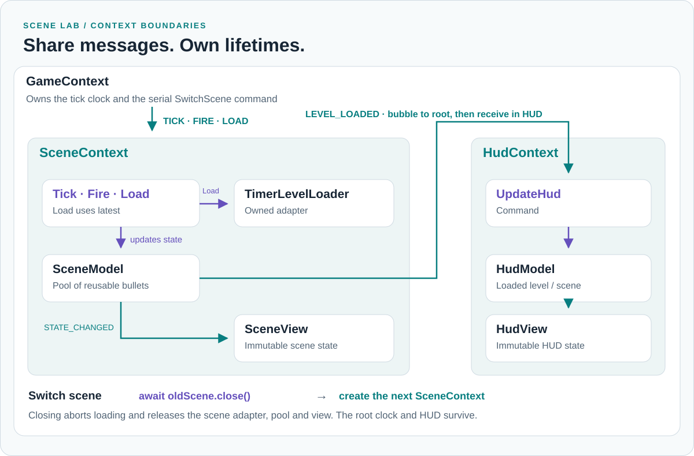

# Scene lab walkthrough

[Documentation](index.md)

Run `npm run example`. The landing page (`index.html`) links to **Counter** (`counter.html`) and **Scene lab** (`game.html`); both examples link back to the chooser. The counter is the smaller introduction; the scene lab shows composition and asynchronous lifetime in one runnable application.

<picture>
  <source media="(prefers-color-scheme: dark)" srcset="assets/scene-contexts-dark.svg">
  
</picture>

## Fire and render

[GameView](../examples/game/views/GameView.ts) owns the DOM listeners. A button invokes its plain `onInput` callback; [GameMediator](../examples/game/mediators/GameMediator.ts) translates that UI intention into `FIRE` and dispatches it from the mediator. The message bubbles to `GameContext`, whose explicit receive predicate admits it into `SceneContext`. There, `map(FIRE, Fire)` runs the [Fire command](../examples/game/commands/Fire.ts).

The command receives the mutable scene-model token. `SceneModel.fire()` obtains a projectile, changes model state and emits `STATE_CHANGED`. The scene context forwards the notification to [SceneMediator](../examples/game/mediators/SceneMediator.ts). It reads the live model through its Immutable token and passes render data to [SceneView](../examples/game/views/SceneView.ts). The view draws the canvas without subscribing to framework messages or resolving models.

[GameDemo](../examples/game/GameDemo.ts) starts and restarts the root context and manages tracing through messages received by that context. [main.ts](../examples/game/main.ts) supplies a [GameViewFactory](../examples/game/views/IGameViewFactory.ts) that borrows the page's DOM mount points. It creates no views during bootstrap. Pause/resume also travels from view callback to mediator message and the mapped [ToggleRunning](../examples/game/commands/ToggleRunning.ts) command.

Each context creates its own mediator. Each mediator requests a fresh view from the injected factory, owns it in a `ResourceScope`, connects callbacks and subscriptions, and disposes it during teardown. `GameMediator` owns `GameView`, `SceneMediator` owns `SceneView`, and `HudMediator` owns `HudView`. DOM listeners belong to the view; application-message subscriptions belong to the mediator. The view is not itself a member of the framework's message hierarchy.

Calling `createGame()` without a view factory runs the same contexts, commands and models without a DOM. Supplying a test factory exercises mediator creation and view disposal with plain objects. Browser contexts explicitly pass the view factory into their child contexts; ready-made views are never registered in DI.

The diagram in the README shows only this route. Its context boundaries also show ownership: `GameView` is inside `GameContext` because `GameMediator` owns it. It intentionally leaves out the independent tick loop, loading and HUD routes.

## Load and update HUD

`LOAD` maps to [Load](../examples/game/commands/Load.ts) with `concurrency: "latest"`. It awaits a [TimerLevelLoader](../examples/game/adapters/TimerLevelLoader.ts), forwarding its abort signal, then commits a model update if still current.

`SceneModel.loaded()` emits local `STATE_CHANGED` and cross-context `LEVEL_LOADED`. The scene's bubble predicate allows only `LEVEL_LOADED` out. The root forwards it to `HudContext` through that child's receive predicate. [UpdateHud](../examples/game/commands/UpdateHud.ts) updates HUD state. [HudMediator](../examples/game/mediators/HudMediator.ts) reads that state and asks [HudView](../examples/game/views/HudView.ts) to render it.

The adapter owns the timer mechanics. The command owns the application decision to apply a loaded result. No additional Service base class is required.

## Switch a scene

`SWITCH` maps to a serial [SwitchScene](../examples/game/commands/SwitchScene.ts) command. The root awaits the old scene's close before creating the new one. Closing cancels active loads and releases the scene's adapter, model pool and view. The root clock and HUD have their own lifetimes and survive a scene switch.

The root provides `SCENE_NAME` and, in the browser, `VIEW_FACTORY` to the new child explicitly. The new scene creates a new mediator and view. Other dependencies do not cross that boundary automatically. Only the configured message predicates cross the routing boundary. A full demo restart recreates all contexts, mediators and views; the page's static mount points remain.

## Pool and diagnostics

`SceneModel` preallocates 12 bullets. Its fire method enforces the active limit before acquisition; inactive bullets are reused. The generic factory's safe-pool mode can otherwise grow capacity, so this demo's bound comes from the model's explicit active-count check.

The trace panel keeps a bounded history in the example. The framework does not retain that history. Resource counters and browser tests verify repeated scene switching and remounting; inspect [verification commands](contributing.md) to reproduce them.
